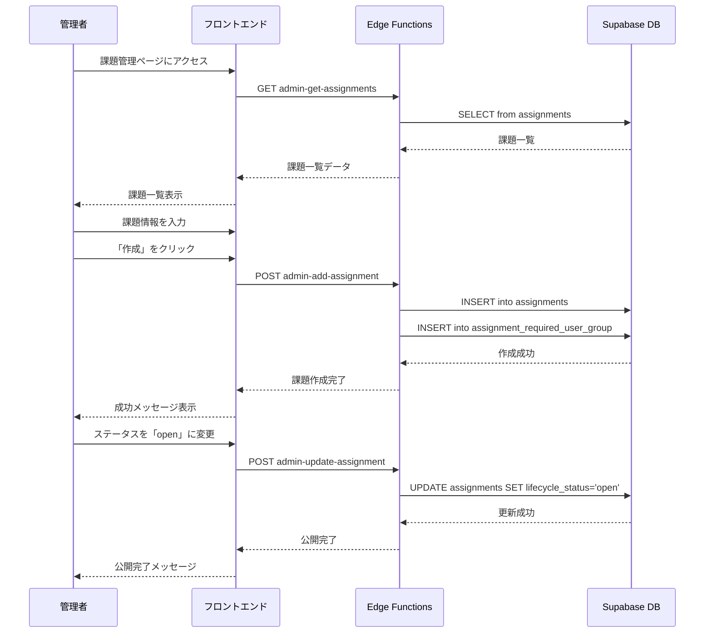
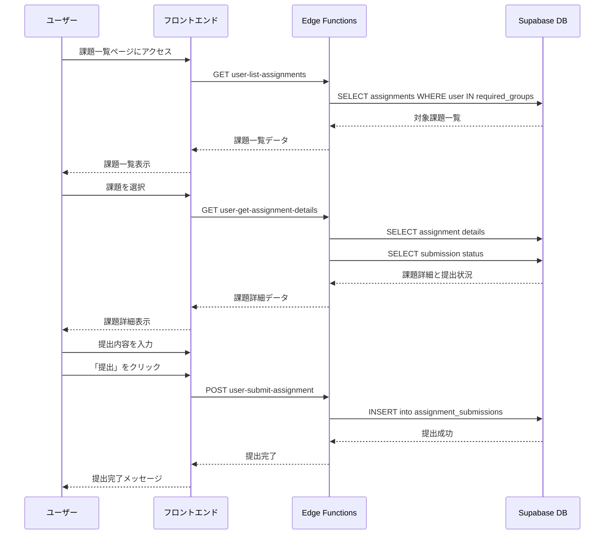
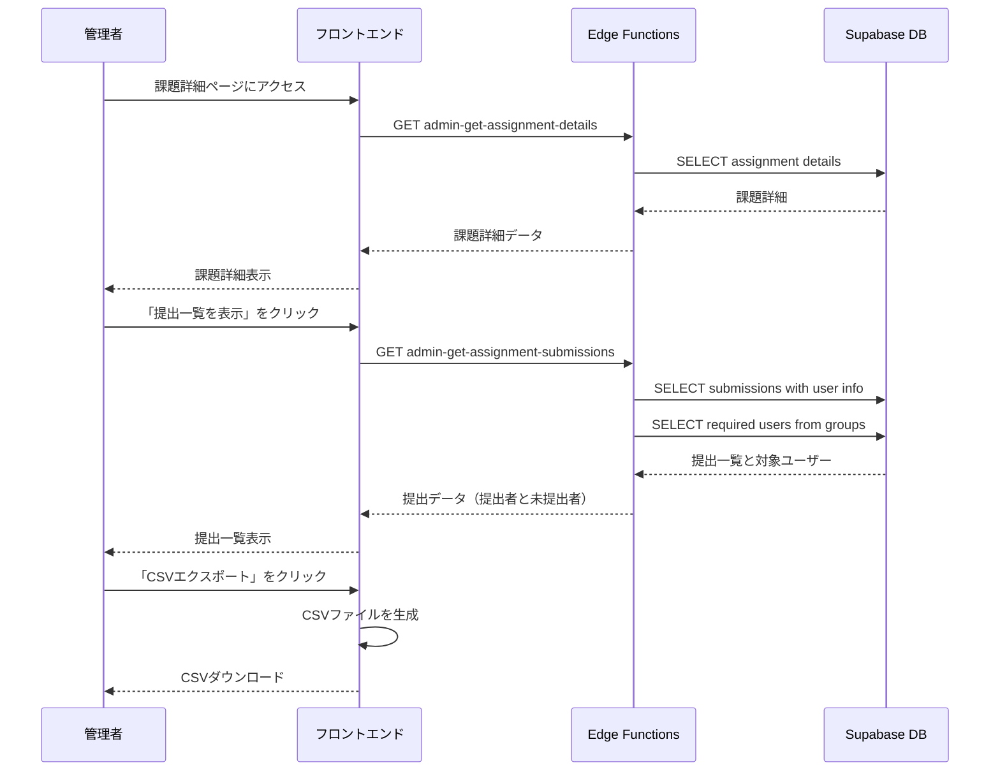

# 課題管理 利用シナリオ

## 概要

このドキュメントは、Community Dashboardアプリケーションにおける課題管理機能の利用シナリオを記述します。課題の作成から提出、確認までの一連のフローと、各ステップで使用されるEdge Functionsを明示します。

## アクター

- **管理者（Community Admin）**: 課題の作成・編集・確認を行う
- **ユーザー（User）**: 課題を閲覧し、提出を行う

---

## シナリオ1: 課題の作成から公開まで

### フロー概要

管理者が新しい課題を作成し、対象ユーザーグループを設定して公開するまでのフローです。

### 詳細手順

| ステップ | アクター | 操作内容 | 使用するEdge Function | HTTPメソッド | 主要なパラメータ | 実装状況 |
|---------|---------|---------|---------------------|------------|----------------|---------|
| 1 | 管理者 | 課題管理ページにアクセス | `admin-get-assignments` | GET | `event_id` (optional) | ✅ 実装済み |
| 2 | 管理者 | 「新規課題作成」ボタンをクリック | - | - | - | - |
| 3 | 管理者 | 課題情報を入力（タイトル、説明、期限等） | - | - | - | - |
| 4 | 管理者 | 課題の指示を設定（テキストまたはファイル） | - | - | - | - |
| 5 | 管理者 | 課題タイプを選択（テキスト提出/ファイル提出/フォーム） | - | - | - | - |
| 6 | 管理者 | 対象ユーザーグループを選択 | - | - | - | - |
| 7 | 管理者 | 「作成」ボタンをクリック | `admin-add-assignment` | POST | `event_id`, `title`, `description`, `instructions_text`, `instructions_storage_path`, `lifecycle_status`, `opens_at`, `due_at`, `instructions_type`, `assignment_type`, `assignment_template_text`, `assignment_template_storage_path`, `form_id`, `user_group_ids` | ✅ 実装済み |
| 8 | システム | 課題を「draft」状態で作成 | - | - | - | - |
| 9 | 管理者 | 課題詳細を確認 | `admin-get-assignment-details` | GET | `assignment_id` | ✅ 実装済み |
| 10 | 管理者 | 必要に応じて課題情報を編集 | `admin-update-assignment` | POST | `assignment_id`, `title`, `description`, `lifecycle_status`, `opens_at`, `due_at`, `instructions_type`, `assignment_type`, `form_id` | ✅ 実装済み |
| 11 | 管理者 | 必要に応じて指示内容を編集 | `admin-update-assignment-instructions` | POST | `assignment_id`, `instructions_text`, `instructions_storage_path`, `assignment_template_text`, `assignment_template_storage_path` | ✅ 実装済み |
| 12 | 管理者 | ステータスを「open」に変更して公開 | `admin-update-assignment` | POST | `assignment_id`, `lifecycle_status: "open"` | ✅ 実装済み |

### データフロー



---

## シナリオ2: ユーザーによる課題の閲覧と提出

### フロー概要

ユーザーが自分に割り当てられた課題を閲覧し、提出を行うまでのフローです。

### 詳細手順

| ステップ | アクター | 操作内容 | 使用するEdge Function | HTTPメソッド | 主要なパラメータ | 実装状況 |
|---------|---------|---------|---------------------|------------|----------------|---------|
| 1 | ユーザー | 課題一覧ページにアクセス | `user-list-assignments` | GET | - | ❌ 未実装 |
| 2 | システム | ユーザーのグループに基づいて課題をフィルタリング | - | - | - | - |
| 3 | ユーザー | 課題一覧から課題を選択 | - | - | - | - |
| 4 | ユーザー | 課題詳細ページを表示 | `user-get-assignment-details` | GET | `assignment_id` | ❌ 未実装 |
| 5 | システム | 課題の指示内容、期限、提出状況を表示 | - | - | - | - |
| 6 | ユーザー | 課題に取り組む | - | - | - | - |
| 7 | ユーザー | 提出内容を入力（テキスト/ファイルアップロード/フォーム回答） | - | - | - | - |
| 8 | ユーザー | 「提出」ボタンをクリック | `user-submit-assignment` | POST | `assignment_id`, `content_text`, `content_storage_path` | ❌ 未実装 |
| 9 | システム | 提出を記録し、提出日時を保存 | - | - | - | - |
| 10 | システム | 提出完了メッセージを表示 | - | - | - | - |

### データフロー



---

## シナリオ3: 管理者による提出内容の確認

### フロー概要

管理者が提出された課題を確認し、評価やフィードバックを行うまでのフローです。

### 詳細手順

| ステップ | アクター | 操作内容 | 使用するEdge Function | HTTPメソッド | 主要なパラメータ | 実装状況 |
|---------|---------|---------|---------------------|------------|----------------|---------|
| 1 | 管理者 | 課題管理ページから課題を選択 | `admin-get-assignments` | GET | `event_id` (optional) | ✅ 実装済み |
| 2 | 管理者 | 課題詳細ページを表示 | `admin-get-assignment-details` | GET | `assignment_id` | ✅ 実装済み |
| 3 | 管理者 | 「提出一覧を表示」をクリック | `admin-get-assignment-submissions` | GET | `assignment_id` | ❌ 未実装 |
| 4 | システム | 提出一覧を表示（提出者名、提出日時、提出内容） | - | - | - | - |
| 5 | 管理者 | 個別の提出内容を確認 | - | - | - | - |
| 6 | 管理者 | 提出内容をダウンロード（ファイルの場合） | - | - | - | - |
| 7 | 管理者 | CSVエクスポート機能で全提出をダウンロード | - | - | - | - |
| 8 | 管理者 | 未提出者を確認 | - | - | - | - |
| 9 | 管理者 | 必要に応じて未提出者にリマインドを送信 | - | - | - | 🔮 将来の機能 |

### データフロー



---

## 必要なEdge Functions一覧

### 実装済み

| Function名 | 役割 | アクセス権限 |
|-----------|-----|------------|
| `admin-get-assignments` | 課題一覧取得 | Community Admin |
| `admin-get-assignment-details` | 課題詳細取得 | Community Admin |
| `admin-add-assignment` | 課題作成 | Community Admin |
| `admin-update-assignment` | 課題情報更新 | Community Admin |
| `admin-update-assignment-instructions` | 課題指示内容更新 | Community Admin |

### 実装済み（続き）

| Function名 | 役割 | アクセス権限 |
|-----------|-----|------------|
| `admin-update-assignment-required-user-groups` | 対象グループ更新 | Community Admin |

### 未実装（今後実装が必要）

| Function名 | 役割 | アクセス権限 | 優先度 |
|-----------|-----|------------|-------|
| `user-list-assignments` | ユーザー向け課題一覧取得 | User | 高 |
| `user-get-assignment-details` | ユーザー向け課題詳細取得 | User | 高 |
| `user-submit-assignment` | 課題提出 | User | 高 |
| `admin-get-assignment-submissions` | 提出一覧取得 | Community Admin | 高 |

---

## データベーステーブル

課題管理機能で使用する主要なテーブル：

### assignments
課題のメイン情報を格納します。

| カラム | 型 | 説明 |
|-------|---|-----|
| id | bigint | 主キー |
| event_id | bigint | 関連イベントID（NULL可） |
| title | text | 課題タイトル |
| description | text | 課題説明 |
| instructions_text | text | 指示内容（テキスト） |
| instructions_storage_path | text | 指示ファイルのパス |
| lifecycle_status | text | ステータス（draft/open/closed） |
| opens_at | timestamp | 公開日時 |
| due_at | timestamp | 締切日時 |
| instructions_type | text | 指示の種類 |
| assignment_type | text | 課題の種類 |
| assignment_template_text | text | テンプレート（テキスト） |
| assignment_template_storage_path | text | テンプレートファイルのパス |
| form_id | bigint | 関連フォームID（NULL可） |

### assignment_required_user_group
課題の対象ユーザーグループを定義します。

| カラム | 型 | 説明 |
|-------|---|-----|
| id | bigint | 主キー |
| assignment_id | bigint | 課題ID |
| user_group_id | bigint | ユーザーグループID |
| requirement | text | 必須度（required等） |

### assignment_submissions
ユーザーの課題提出を格納します。

| カラム | 型 | 説明 |
|-------|---|-----|
| id | bigint | 主キー |
| assignment_id | bigint | 課題ID |
| user_id | uuid | 提出者ID |
| content_text | text | 提出内容（テキスト） |
| content_storage_path | text | 提出ファイルのパス |
| submitted_at | timestamp | 提出日時 |

---

## ユーザーインターフェース

### 管理者向け画面

#### 課題管理ページ
- 課題一覧（タイトル、ステータス、期限、提出状況）
- 新規作成ボタン
- フィルタリング機能（イベント別、ステータス別）

#### 課題詳細パネル
- 基本情報タブ（タイトル、説明、期限等の編集）
- 指示内容タブ（テキスト/ファイル設定）
- 対象グループタブ（ユーザーグループ選択）
- 提出一覧タブ（提出状況の確認、CSVエクスポート）

### ユーザー向け画面

#### 課題一覧ページ
- 自分に割り当てられた課題の一覧
- 提出状況の表示（未提出/提出済み）
- 期限の表示
- フィルタリング機能（未提出/提出済み）

#### 課題詳細・提出ページ
- 課題タイトルと説明
- 指示内容の表示
- テンプレートのダウンロード（ある場合）
- 提出フォーム（テキスト入力/ファイルアップロード）
- 提出ボタン
- 提出済みの場合は提出内容の表示

---

## 補足

### lifecycle_statusの状態遷移

```
draft (下書き) → open (公開中) → closed (終了)
                      ↓
                   draft (再編集)
```

- **draft**: 作成中または編集中の状態。ユーザーには表示されない
- **open**: 公開中の状態。対象ユーザーに表示され、提出可能
- **closed**: 終了した状態。閲覧は可能だが提出不可

### 課題タイプ

実装予定の課題タイプ：
- **text**: テキスト提出（`content_text`に保存）
- **file**: ファイル提出（`content_storage_path`に保存）
- **form**: フォーム回答（`form_id`で関連付け）

### 対象ユーザーの判定

ユーザーが課題の対象かどうかは以下のロジックで判定：
1. `assignment_required_user_group`テーブルから課題の対象グループIDを取得
2. `user_user_group`テーブルでユーザーが対象グループに所属しているか確認
3. 所属している場合、そのユーザーに課題を表示

### 未提出者の確認

管理者が未提出者を確認する際のロジック：
1. 対象グループに所属する全ユーザーを取得
2. `assignment_submissions`テーブルで提出済みユーザーを取得
3. 差分を未提出者として表示
