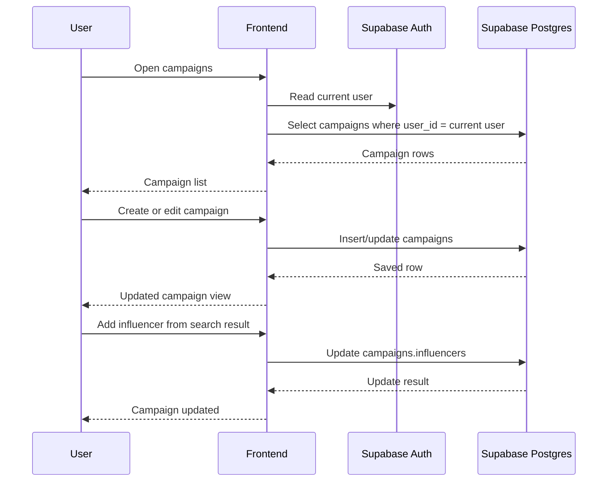

# Campaign Usage Scenario

This file replaces an older assignment-management scenario from a previous app concept. The current product does not implement assignments. The comparable workflow in the current app is campaign management.

## Actors

- User: authenticated marketer or campaign operator.
- Frontend: React app in `frontend-influencer/`.
- Backend: Supabase Postgres plus optional Edge Functions.

## Scenario 1: Create a Campaign

1. The user opens the campaign page.
2. The frontend reads existing campaign records from `campaigns` filtered by `user_id`.
3. The user clicks the create campaign action.
4. The user enters campaign metadata such as name, description, budget, goal, status, start date, and end date.
5. The frontend inserts a `campaigns` row scoped to the authenticated user.
6. The user returns to the campaign list and sees the new campaign grouped by status.

Current implementation paths:

- `frontend-influencer/src/pages/campaign/campaign.tsx`
- `frontend-influencer/src/pages/campaign/create_campaign.tsx`
- `supabase/functions/campaign-create/index.ts`

## Scenario 2: Add an Influencer to a Campaign

1. The user searches influencers from the search page.
2. The frontend queries `sns_accounts` with embedded latest `accounts_metrics`.
3. The user opens the add-to-campaign dialog from a search result.
4. The frontend lists the user's campaigns from `campaigns`.
5. The user selects a campaign.
6. The frontend appends the influencer account name to `campaigns.influencers`.

Current implementation path:

- `frontend-influencer/src/pages/search/search_results.tsx`

## Scenario 3: Review and Edit a Campaign

1. The user opens the campaign list.
2. The frontend loads campaign rows for the authenticated user.
3. The user opens a campaign detail view.
4. The user can navigate to edit and update campaign metadata.

Current implementation paths:

- `frontend-influencer/src/pages/campaign/campaign_detail.tsx`
- `frontend-influencer/src/pages/campaign/campaign_edit.tsx`

## Data Flow

```mermaid
sequenceDiagram
  participant User
  participant UI as Frontend
  participant Auth as Supabase Auth
  participant DB as Supabase Postgres

  User->>UI: Open campaigns
  UI->>Auth: Read current user
  UI->>DB: Select campaigns where user_id = current user
  DB-->>UI: Campaign rows
  UI-->>User: Campaign list

  User->>UI: Create or edit campaign
  UI->>DB: Insert/update campaigns
  DB-->>UI: Saved row
  UI-->>User: Updated campaign view

  User->>UI: Add influencer from search result
  UI->>DB: Update campaigns.influencers
  DB-->>UI: Update result
  UI-->>User: Campaign updated
```

## Tables

- `campaigns`: campaign metadata and selected influencer names.
- `sns_accounts`: influencer records selected into campaigns.
- `users`: profile records tied to Supabase Auth users.

## Notes

- `campaigns.influencers` is currently a text field. A future normalization could replace it with a join table such as `campaign_influencer`.
- Campaign access should remain scoped to `campaigns.user_id`.
