# データベーススキーマ

## 概要

このドキュメントは、Community Dashboardアプリケーションのデータベーススキーマを記述します。
このスキーマは、コミュニティのイベント、フォーム、ユーザー、および関連する活動を管理するために設計されています。

## スキーマ図

```mermaid
erDiagram
    organizations {
        bigint id PK
        timestamp created_at
        timestamp updated_at
        text name
    }

    user_types {
        bigint id PK
        timestamp created_at
        timestamp updated_at
        text type UK
    }

    users {
        uuid id PK "FK to auth.users"
        timestamp created_at
        timestamp updated_at
        text name
        text email
        text icon_storage_path
    }

    user_groups {
        bigint id PK
        timestamp created_at
        timestamp updated_at
        text name UK
    }

    organization_user {
        bigint id PK
        timestamp created_at
        bigint organization_id FK
        uuid user_id FK
    }

    user_user_type {
        bigint id PK
        timestamp created_at
        uuid user_id FK
        bigint user_type_id FK
    }

    user_user_group {
        bigint id PK
        timestamp created_at
        bigint user_group_id FK
        uuid user_id FK
    }

    venues {
        bigint id PK
        timestamp created_at
        timestamp updated_at
        text name
        text address
        integer capacity
    }

    event_types {
        bigint id PK
        timestamp created_at
        timestamp updated_at
        text type UK
    }

    events {
        bigint id PK
        timestamp created_at
        timestamp updated_at
        text title
        text description
        timestamp starts_at
        timestamp ends_at
        bigint venue_id FK
        text online_url
        bigint event_type_id FK
        boolean is_private "default: true"
        text thumbnail_storage_path
    }

    event_participant_group {
        bigint id PK
        timestamp created_at
        timestamp updated_at
        bigint event_id FK
        bigint user_group_id FK
        text requirement "default: required"
    }

    event_attendances {
        bigint id PK
        timestamp created_at
        timestamp updated_at
        text status
        uuid user_id FK
        bigint event_id FK
    }

    tasks {
        bigint id PK
        timestamp created_at
        timestamp updated_at
        bigint event_id FK
        text title
        text description
        text progress_status "default: todo"
        text priority "default: normal"
        timestamp due_at
        timestamp completed_at
    }

    task_assignee {
        bigint id PK
        timestamp created_at
        bigint task_id FK
        uuid assignee_user_id FK
    }

    event_program_items {
        bigint id PK
        timestamp created_at
        timestamp updated_at
        bigint event_id FK
        text title
        timestamp starts_at
        timestamp ends_at
        bigint venue_id FK
    }

    guest_types {
        bigint id PK
        timestamp created_at
        timestamp updated_at
        text type UK
    }

    guests {
        bigint id PK
        timestamp created_at
        timestamp updated_at
        uuid user_id FK
        text name
        bigint organization_id FK
        text title
        text email
        text phone_number
    }

    event_guest {
        bigint id PK
        timestamp created_at
        timestamp updated_at
        bigint event_id FK
        bigint guest_id FK
        bigint guest_type_id FK
    }

    official_projects {
        bigint id PK
        timestamp created_at
        timestamp updated_at
        text name_ja
        text name_en
        uuid leader_user_id FK
        text thumbnail_path
    }

    official_article_groups {
        bigint id PK
        timestamp created_at
        text name
        text thumbnail_storage_path
    }

    official_articles {
        bigint id PK
        timestamp created_at
        timestamp published_at
        text title
        text lifecycle_status
        text markdown_storage_path
        bigint official_article_group_id FK
    }

    form_question_formats {
        bigint id PK
        timestamp created_at
        timestamp updated_at
        text format UK
        text value_type
        boolean has_options "default: false"
    }

    forms {
        bigint id PK
        timestamp created_at
        timestamp updated_at
        text name
        text description
        text form_url
        text source
        text lifecycle_status "default: draft"
        bigint event_id FK
        bigint official_project_id FK
    }

    form_questions {
        bigint id PK
        bigint form_id FK
        timestamp created_at
        timestamp updated_at
        text label
        bigint form_question_format_id FK
        integer position
    }

    form_question_options {
        bigint id PK
        timestamp created_at
        timestamp updated_at
        text option
        smallint sort_order
        bigint form_question_id FK
    }

    form_rating_settings {
        bigint id PK
        timestamp created_at
        timestamp updated_at
        bigint form_question_id FK
        smallint step_count
        text low_label
        text high_label
    }

    form_respondent_group {
        bigint id PK
        timestamp created_at
        timestamp updated_at
        bigint form_id FK
        bigint user_group_id FK
        text requirement "default: required"
    }

    form_responses {
        bigint id PK
        timestamp created_at
        timestamp updated_at
        bigint form_id FK
        uuid user_id FK
        timestamp submitted_at
        text response_key
    }

    form_response_answers {
        bigint id PK
        timestamp created_at
        timestamp updated_at
        bigint form_question_id FK
        bigint form_response_id FK
        text answer_text
        numeric answer_number
        timestamp answer_timestamp
        boolean answer_bool
        jsonb answer_json
    }

    form_import_files {
        bigint id PK
        timestamp created_at
        bigint form_id FK
        text file_path
    }

    assignments {
        bigint id PK
        timestamp created_at
        timestamp updated_at
        bigint event_id FK
        text title
        text description
        text instructions_text
        text instructions_storage_path
        text lifecycle_status "default: draft"
        timestamp opens_at
        timestamp due_at
        text instructions_type
        text assignment_type
        text assignment_template_text
        text assignment_template_storage_path
        bigint form_id FK
    }

    assignment_required_user_group {
        bigint id PK
        timestamp created_at
        timestamp updated_at
        bigint assignment_id FK
        bigint user_group_id FK
        text requirement "default: required"
    }

    assignment_submissions {
        bigint id PK
        timestamp created_at
        timestamp submitted_at
        bigint assignment_id FK
        uuid user_id FK
        text content_text
        text content_storage_path
    }

    inquiries {
        bigint id PK
        timestamp created_at
        timestamp updated_at
        uuid requester_user_id FK
        bigint event_id FK
        uuid assignee_user_id FK
        text subject
        text body
        text inquiry_status "default: open"
    }

    %% コアエンティティのリレーション
    organizations ||--o{ organization_user : "含む"
    organizations ||--o{ guests : "所属"
    user_types ||--o{ user_user_type : "分類"
    users ||--o{ organization_user : "所属"
    users ||--o{ user_user_type : "持つ"
    users ||--o{ user_user_group : "所属"
    users ||--o{ official_projects : "リーダー"
    users ||--o{ form_responses : "回答者"
    users ||--o{ inquiries : "依頼者"
    users ||--o{ inquiries : "担当者"
    users ||--o{ task_assignee : "担当者"
    users ||--o{ guests : "リンク"
    user_groups ||--o{ user_user_group : "含む"
    user_groups ||--o{ event_participant_group : "参加"
    user_groups ||--o{ form_respondent_group : "回答"
    user_groups ||--o{ assignment_required_user_group : "課題対象"

    %% イベント関連のリレーション
    event_types ||--o{ events : "分類"
    venues ||--o{ events : "会場"
    venues ||--o{ event_program_items : "会場"
    events ||--o{ event_participant_group : "対象"
    events ||--o{ event_attendances : "出欠"
    events ||--o{ tasks : "タスク"
    events ||--o{ event_program_items : "プログラム"
    events ||--o{ event_guest : "ゲスト"
    events ||--o{ forms : "関連フォーム"
    events ||--o{ inquiries : "関連問い合わせ"
    users ||--o{ event_attendances : "出欠"
    tasks ||--o{ task_assignee : "割り当て"
    guests ||--o{ event_guest : "参加"
    guest_types ||--o{ event_guest : "種別"

    %% フォーム関連のリレーション
    forms ||--o{ form_questions : "質問"
    forms ||--o{ form_responses : "回答"
    forms ||--o{ form_respondent_group : "対象グループ"
    forms ||--o{ form_import_files : "インポートファイル"
    form_question_formats ||--o{ form_questions : "質問形式"
    form_questions ||--o{ form_question_options : "選択肢"
    form_questions ||--o{ form_rating_settings : "評価設定"
    form_questions ||--o{ form_response_answers : "回答"
    form_responses ||--o{ form_response_answers : "含む"
    official_projects ||--o{ forms : "管理"

    %% 課題関連のリレーション
    events ||--o{ assignments : "課題"
    forms ||--o{ assignments : "関連フォーム"
    assignments ||--o{ assignment_required_user_group : "対象グループ"
    assignments ||--o{ assignment_submissions : "提出"
    users ||--o{ assignment_submissions : "提出者"

    %% 記事関連のリレーション
    official_article_groups ||--o{ official_articles : "含む"
```

## テーブルグループ

### コアエンティティ

#### organizations (組織)
ユーザーやスピーカーが所属する組織を表します。

#### users (ユーザー)
認証ユーザーにリンクされた、コアとなるユーザー情報です。

#### user_types (ユーザー種別)
利用可能なユーザー種別を定義します。

#### user_groups (ユーザーグループ)
ユーザーが所属できるグループです。

#### organization_user (組織ユーザー)
ユーザーと組織をリンクする中間テーブルです。

#### user_user_type (ユーザーユーザー種別)
ユーザーとユーザー種別をリンクする中間テーブルです。

#### user_user_group (ユーザーユーザーグループ)
ユーザーとユーザーグループをリンクする中間テーブルです。

### イベント管理

#### events (イベント)
イベントのメイン情報を格納します。

#### event_types (イベント種別)
イベントのカテゴリを定義します。

#### event_participant_group (イベント参加グループ)
どのユーザーグループがイベントに参加すべきかを定義する中間テーブルです。

#### event_attendances (イベント出欠)
ユーザーのイベントへの出欠状況を管理します。statusフィールドで出席・欠席・未定等の状態を保持します。

#### tasks (タスク)
イベントに関連するタスクを管理します。

#### task_assignee (タスク担当者)
タスクにユーザーを割り当てる中間テーブルです。

#### event_program_items (イベントプログラム項目)
イベントのプログラム/スケジュールの個別項目です。

### ゲスト管理

#### guest_types (ゲスト種別)
ゲストの種別を定義します（講師、見学者等）。

#### guests (ゲスト)
イベントゲストの情報を格納します。内部ユーザーまたは外部の方がゲストになれます。

#### event_guest (イベントゲスト)
ゲストとイベントをリンクする中間テーブルです。ゲスト種別も指定します。

### 会場管理

#### venues (会場)
イベントの物理的または仮想的な会場情報です。

### フォーム管理

#### forms (フォーム)
情報収集のためのフォームです。lifecycle_statusでフォームの状態（draft：下書き、open：公開中、closed：終了）を管理します。

#### form_questions (フォーム質問)
フォーム内の質問項目です。

#### form_question_formats (質問形式)
利用可能な質問形式を定義します。value_typeで値の型、has_optionsで選択肢の有無を指定します。

定義済みの質問形式:
- id: 1, format: `internal_text` - 自由記述（テキストエリア）
- id: 2, format: `internal_single_select` - 単一選択（ラジオボタン、選択肢が必要）
- id: 3, format: `internal_multi_select` - 複数選択（チェックボックス、選択肢が必要）
- id: 4, format: `internal_rating` - 五段階評価（1-5の評価）

#### form_question_options (質問選択肢)
選択式質問の選択肢を格納します。

#### form_rating_settings (評価設定)
評価形式の質問（internal_rating）の設定を格納します。step_countで評価段階数（例: 5段階評価なら5）、low_labelで最低評価のラベル、high_labelで最高評価のラベルを設定します。

#### form_respondent_group (フォーム回答対象グループ)
どのグループがフォームに回答すべきかを定義する中間テーブルです。

#### form_responses (フォーム回答)
個別のフォーム提出を表します。

#### form_response_answers (フォーム回答詳細)
フォーム回答内の個別の回答を格納します。

#### form_import_files (フォームインポートファイル)
フォームデータ用にインポートされたファイルです。

### 課題管理

#### assignments (課題)
イベントに関連する課題を管理します。lifecycle_statusで課題の状態（draft：下書き、open：公開中、closed：終了）を管理します。instructions_typeで指示の種類、assignment_typeで提出物の種類を指定できます。form_idでフォームと連携することも可能です。

定義済みの提出物タイプ (assignment_type):
- `text` - テキスト形式の提出物（assignment_submissions.content_textに保存）
- `markdown` - マークダウン形式の提出物（assignment_submissions.content_storage_pathに保存）
- `file` - ファイル形式の提出物（assignment_submissions.content_storage_pathに保存）

#### assignment_required_user_group (課題対象グループ)
どのユーザーグループが課題に取り組むべきかを定義する中間テーブルです。requirementフィールドで必須度を指定します（デフォルト: required）。

#### assignment_submissions (課題提出)
ユーザーの課題提出を格納します。content_textでテキスト形式の提出内容、content_storage_pathでファイル形式の提出内容を管理します。

### プロジェクト管理

#### official_projects (公式プロジェクト)
コミュニティの公式プロジェクトを管理します。

#### official_article_groups (公式記事グループ)
公式記事をグループ化するためのカテゴリを管理します。記事をテーマやトピック別に整理できます。

#### official_articles (公式記事)
コミュニティの公式記事を管理します。lifecycle_statusで記事の状態（draft：下書き、published：公開中、unpublished：非公開）を管理します。published_atで公開日時を設定でき、未来の日時を指定することで予約公開が可能です。マークダウン形式の記事をストレージに保存します。

### 問い合わせ管理

#### inquiries (問い合わせ)
サポート問い合わせやリクエストを管理します。

## インデックスとパフォーマンスの考慮事項

インデックスを検討すべき主要な箇所：
- JOIN パフォーマンスのための外部キー列
- グループ別ユーザー検索のための `user_user_group`
- 組織別ユーザー検索のための `organization_user`
- ユーザー種別検索のための `user_user_type`
- フィルタリングのための `tasks.progress_status`
- 時系列クエリのための `form_responses.submitted_at`
- 未対応問い合わせフィルタリングのための `inquiries.inquiry_status`
- イベント別ゲスト検索のための `event_guest.event_id`
- プライベートイベントフィルタリングのための `events.is_private`
- 課題別対象グループ検索のための `assignment_required_user_group.assignment_id`
