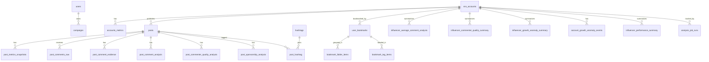

# Database Schema

This document describes the current influencer analytics data model used by the frontend, Supabase Edge Functions, and Python scraper jobs. It is a practical table map, not a full generated DDL dump.

## Core Relationship Map


```mermaid
erDiagram
  users ||--o{ campaigns : owns
  sns_accounts ||--o{ accounts_metrics : has
  sns_accounts ||--o{ posts : publishes
  posts ||--o{ post_metrics_snapshots : has
  posts ||--o{ post_comments_raw : receives
  posts ||--o{ post_comment_evidence : has
  posts ||--o{ post_comment_analysis : has
  posts ||--o{ post_commenter_quality_analysis : has
  posts ||--o{ post_sponsorship_analysis : has
  posts ||--o{ post_hashtag : tagged
  hashtags ||--o{ post_hashtag : joins
  sns_accounts ||--o{ user_bookmarks : bookmarked_by
  user_bookmarks ||--o{ bookmark_folder_items : grouped_in
  user_bookmarks ||--o{ bookmark_tag_items : labeled_in
  sns_accounts ||--o{ influencer_average_comment_analysis : summarizes
  sns_accounts ||--o{ influencer_commenter_quality_summary : summarizes
  sns_accounts ||--o{ influencer_growth_anomaly_summary : summarizes
  sns_accounts ||--o{ account_growth_anomaly_events : has
  sns_accounts ||--o{ influencer_performance_summary : summarizes
  sns_accounts ||--o{ analysis_job_runs : tracked_by
```

## User and Campaign Tables

### `users`

Profile table for Supabase-authenticated users.

Common fields used by the code:

- `id`: UUID matching Supabase Auth user id.
- `email`: user email.
- `name`, `company`, `role`, `timezone`, `language`: profile metadata from registration/profile upsert.
- `email_verified`: mirrored from Supabase Auth email confirmation.
- `created_at`, `updated_at`: timestamps when available.

Used by:

- `frontend-influencer/src/contexts/AuthContext.tsx`
- `supabase/functions/profile-upsert`
- `supabase/functions/auth-email-verified`

### `campaigns`

Campaign records owned by users.

Common fields used by the code:

- `id`
- `user_id`
- `name`
- `description`
- `start_date`
- `end_date`
- `budget`
- `goal`
- `status`
- `influencers`: legacy text cache. `campaign_influencers` is the normalized source of truth.
- `created_at`

Used by:

- campaign list/create/edit/detail pages
- `supabase/functions/campaign-create`
- `supabase/functions/campaign-list`
- search result add-to-campaign workflow

## Influencer Account Tables

### `sns_accounts`

Primary influencer account table.

Common fields used by the code:

- `id`
- `platform`: `instagram`, `tiktok`, `youtube`, or `x`.
- `platform_user_id`: external platform identifier when available.
- `profile_id`: source profile identifier for connected Instagram sync flows.
- `account_name`
- `account_url`
- `caption`
- `profile_image_url`
- `country`
- `email`
- `language`
- `gender`
- `does_livestream`
- `keywords`: comma-separated keyword text.
- `is_verified`
- `last_profile_scraped_at`
- `last_posts_scraped_at`

Important uniqueness patterns:

- Many ingesters upsert by `platform, platform_user_id`.
- Some platform flows upsert by `platform, account_name`.

### `accounts_metrics`

Time-series account metrics.

Common fields:

- `id`
- `account_id`
- `metric_date`
- `followers`
- `posts`
- `maximum_likes`
- `videos`

Important uniqueness pattern:

- `account_id, metric_date`

Used by frontend search/detail views and growth/performance analysis.

## Bookmark Tables

### `user_bookmarks`

Primary bookmark table.

Common fields used by the code:

- `id`
- `user_id`
- `account_id`
- `priority`
- `personal_rating`
- `candidate_readiness`
- `risk_level`
- `risk_notes`
- `estimated_price_min`
- `estimated_price_max`
- `price_note`
- `price_checked_at`
- `contact_info`
- `saved_snapshot`
- `research_checklist`
- `saved_reason`
- `private_memo`
- `saved_source`
- `saved_source_detail`
- `created_at`
- `updated_at`

Important uniqueness pattern:

- `user_id, account_id`

### `bookmark_folders` and `bookmark_folder_items`

- `bookmark_folders` stores user-defined bookmark folders.
- `bookmark_folder_items` links a folder to `user_bookmarks.id` via `bookmark_id`.

### `bookmark_tags` and `bookmark_tag_items`

- `bookmark_tags` stores user-defined bookmark tags.
- `bookmark_tag_items` links a tag to `user_bookmarks.id` via `bookmark_id`.

## Post and Hashtag Tables

### `posts`

Platform posts for an influencer account.

Common fields:

- `id`
- `account_id`
- `external_post_id`
- `link`
- `caption`
- `posted_at`
- `scraped_at`

Important uniqueness pattern:

- `external_post_id`

### `post_metrics_snapshots`

Time-series post metrics captured during post ingestion.

Common fields:

- `id`
- `post_id`
- `account_id`
- `snapshot_at` or equivalent capture timestamp
- platform-specific engagement counters such as likes, comments, views, shares, or plays.

Snapshots are inserted as time-series rows. They are not treated as a single upserted current-state row.

### `hashtags`

Canonical hashtag table.

Common fields:

- `id`
- `tag`
- `language`

Important uniqueness pattern:

- `tag`

### `post_hashtag`

Join table between posts and hashtags.

Important uniqueness pattern:

- `post_id, hashtag_id`

## Comment Analysis Tables

### `post_comments_raw`

Raw or filtered raw comments collected for a post.

Common fields include:

- `post_id`
- commenter identity fields when available
- comment text
- timestamps and platform metadata when available

### `post_comment_evidence`

Evidence rows sampled during comment analysis for traceability/debugging.

### `post_comment_analysis`

Per-post aggregate comment analysis.

Common fields used by aggregators:

- `post_id`
- sentiment, toxicity, hate, spam, conversion-intent, emotion, language, and topic outputs
- sampled and filtered counts
- `analysis_version`
- `updated_at`

### `influencer_average_comment_analysis`

Account-level aggregate of post comment analysis.

Common fields used by the frontend:

- `account_id`
- `window`, usually `all_posts`
- `posts_count`
- `avg_sentiment`
- `avg_toxicity`
- `avg_hate_score`
- `avg_conversion_intent_rate`
- `avg_spam_rate`
- `sum_sampled_total`
- `sum_filtered_total`
- `avg_emotion`
- `avg_language`
- `avg_topics`
- `updated_at`

Important uniqueness pattern:

- `account_id, window`

## Newer Analysis Tables

### `post_commenter_quality_analysis`

Per-post commenter quality analysis.

Important uniqueness pattern:

- `post_id, analysis_version`

Written by:

- `apify-scrapers/post_commenter_quality_analyze.py`

### `influencer_commenter_quality_summary`

Account-level commenter quality summary.

Fields created by the current migration:

- `id`
- `account_id`
- `platform`
- `window_label`
- `avg_unique_commenters`
- `avg_comments_per_commenter`
- `avg_repeat_commenter_rate`
- `avg_substantive_comment_rate`
- `avg_question_rate`
- `avg_low_signal_comment_rate`
- `avg_suspicious_commenter_rate`
- `posts_used`
- `analysis_version`
- `created_at`
- `updated_at`

Important uniqueness pattern:

- `account_id, window_label, analysis_version`

### `post_sponsorship_analysis`

Per-post sponsorship detection.

Important uniqueness pattern:

- `post_id, analysis_version`

Written by:

- `apify-scrapers/post_sponsorship_analyze.py`

### `account_growth_anomaly_events`

Event-level growth anomaly records for account metric history.

Important uniqueness pattern:

- `account_id, metric_date, analysis_version`

### `influencer_growth_anomaly_summary`

Account-level growth anomaly summary.

Important fields:

- `account_id`
- `platform`
- `window_label`
- `growth_anomaly_score`
- `analysis_status`
- `latest_metric_date`
- `analysis_version`
- `updated_at`

Allowed `analysis_status` values:

- `ok`
- `no_metrics`
- `stale_source_data`
- `insufficient_history`

Important uniqueness pattern:

- `account_id, window_label, analysis_version`

### `influencer_performance_summary`

Account-level performance summary.

Important fields:

- `account_id`
- `platform`
- `window`
- `engagement_trend_score`
- `posts_used`
- `updated_at`

Important uniqueness pattern:

- `account_id, window`

Note: `window` is a PostgreSQL keyword, so migration SQL must quote it as `"window"` when used in DDL.

## Job Tracking and Schema Validation

### `analysis_job_runs`

Step-level run log for `bookmarked_weekly_refresh.py`.

Fields:

- `id`
- `analysis_name`
- `account_id`
- `platform`
- `status`
- `rows_written`
- `error_message`
- `details`
- `analysis_version`
- `started_at`
- `finished_at`
- `created_at`

Common `analysis_name` values:

- `refresh_posts`
- `post_comment_analysis`
- `post_sponsorship`
- `commenter_quality`
- `commenter_quality_summary`
- `account_comment_average`
- `growth_anomaly`
- `performance_summary`

Common statuses:

- `success`
- `skipped`
- `partial`
- `failed`
- growth-specific non-crash statuses such as `stale_source_data`.

### `analysis_unique_indexes`

View over unique indexes in the public schema. The scraper pipeline uses it to verify required uniqueness before doing idempotent upserts.

Current exposed columns:

- `schemaname`
- `tablename`
- `indexname`
- `indexdef`

The Python validation code accepts both `tablename/indexname` and `table_name/index_name`, but the migration keeps the existing `tablename/indexname` names to avoid PostgreSQL view column rename errors.

## Migration Files

Current migration files:

- `supabase/migrations/20260412_analysis_status_and_job_runs.sql`
- `supabase/migrations/20260413_commenter_summary_and_index_validation.sql`

Apply them with:

```bash
supabase db push
```

Then run a backend smoke refresh:

```bash
BOOKMARK_PLATFORMS=instagram \
BOOKMARK_ANALYSIS_REFRESH_HOURS=0 \
BOOKMARK_MAX_ACCOUNTS_PER_RUN=1 \
BOOKMARK_ANALYZE_POSTS_PER_ACCOUNT=3 \
BOOKMARK_SLEEP_SECONDS=0 \
.venv/bin/python apify-scrapers/bookmarked_weekly_refresh.py
```
