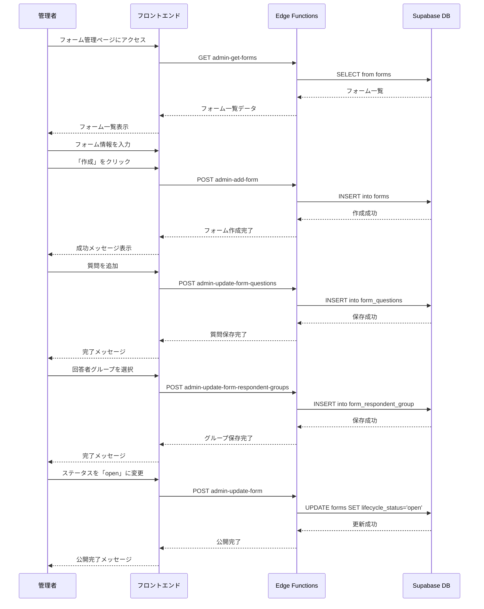
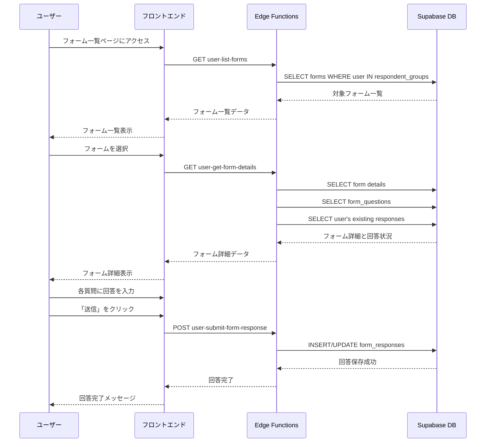
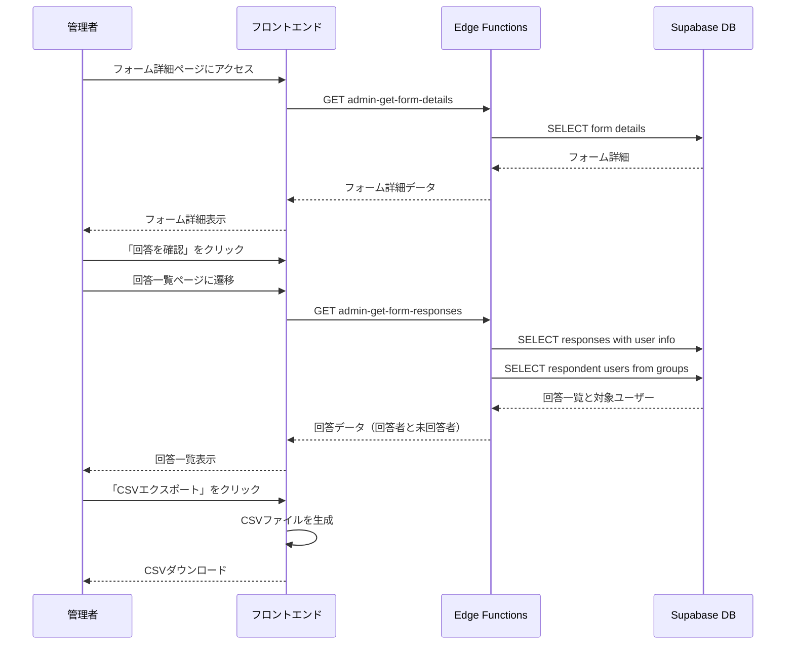

# フォーム管理 利用シナリオ

## 概要

このドキュメントは、Community Dashboardアプリケーションにおけるフォーム管理機能の利用シナリオを記述します。フォームの作成から回答、確認までの一連のフローと、各ステップで使用されるEdge Functionsを明示します。

## アクター

- **管理者（Community Admin）**: フォームの作成・編集・回答確認を行う
- **ユーザー（User）**: フォームを閲覧し、回答を行う

---

## シナリオ1: フォームの作成から公開まで

### フロー概要

管理者が新しいフォームを作成し、質問項目を設定し、対象回答者グループを指定して公開するまでのフローです。

### 詳細手順

| ステップ | アクター | 操作内容 | 使用するEdge Function | HTTPメソッド | 主要なパラメータ | 実装状況 |
|---------|---------|---------|---------------------|------------|----------------|---------|
| 1 | 管理者 | フォーム管理ページにアクセス | `admin-get-forms` | GET | `event_id` (optional) | ✅ 実装済み |
| 2 | 管理者 | 「新規フォーム作成」ボタンをクリック | - | - | - | - |
| 3 | 管理者 | フォーム情報を入力（タイトル、説明等） | - | - | - | - |
| 4 | 管理者 | 「作成」ボタンをクリック | `admin-add-form` | POST | `event_id`, `title`, `description`, `lifecycle_status`, `opens_at`, `closes_at` | ✅ 実装済み |
| 5 | システム | フォームを「draft」状態で作成 | - | - | - | - |
| 6 | 管理者 | フォーム詳細を確認 | `admin-get-form-details` | GET | `form_id` | ✅ 実装済み |
| 7 | 管理者 | 質問タブで質問を追加 | - | - | - | - |
| 8 | 管理者 | 質問テキスト、質問タイプ、必須項目等を設定 | - | - | - | - |
| 9 | 管理者 | 「質問を保存」をクリック | `admin-update-form-questions` | POST | `form_id`, `questions` (配列) | ✅ 実装済み |
| 10 | 管理者 | 回答者グループタブで対象グループを選択 | - | - | - | - |
| 11 | 管理者 | 「グループを保存」をクリック | `admin-update-form-respondent-groups` | POST | `form_id`, `respondent_group_ids` | ✅ 実装済み |
| 12 | 管理者 | 基本情報タブでステータスを「open」に変更 | `admin-update-form` | POST | `form_id`, `lifecycle_status: "open"` | ✅ 実装済み |
| 13 | システム | フォームを公開し、対象ユーザーに表示 | - | - | - | - |

### データフロー



---

## シナリオ2: ユーザーによるフォームの閲覧と回答

### フロー概要

ユーザーが自分に割り当てられたフォームを閲覧し、回答を行うまでのフローです。

### 詳細手順

| ステップ | アクター | 操作内容 | 使用するEdge Function | HTTPメソッド | 主要なパラメータ | 実装状況 |
|---------|---------|---------|---------------------|------------|----------------|---------|
| 1 | ユーザー | フォーム一覧ページにアクセス | `user-list-forms` | GET | - | ✅ 実装済み |
| 2 | システム | ユーザーのグループに基づいてフォームをフィルタリング | - | - | - | - |
| 3 | ユーザー | フォーム一覧からフォームを選択 | - | - | - | - |
| 4 | ユーザー | フォーム詳細ページを表示 | `user-get-form-details` | GET | `form_id` | ✅ 実装済み |
| 5 | システム | フォームの説明、質問項目、回答状況を表示 | - | - | - | - |
| 6 | ユーザー | 各質問に回答を入力 | - | - | - | - |
| 7 | ユーザー | 「送信」ボタンをクリック | `user-submit-form-response` | POST | `form_id`, `responses` (配列) | ✅ 実装済み |
| 8 | システム | 回答を記録し、提出日時を保存 | - | - | - | - |
| 9 | システム | 回答完了メッセージを表示 | - | - | - | - |
| 10 | ユーザー | 回答済みフォームの場合、自分の回答内容を閲覧 | - | - | - | - |

### データフロー



---

## シナリオ3: 管理者による回答内容の確認

### フロー概要

管理者が提出されたフォーム回答を確認し、分析やエクスポートを行うまでのフローです。

### 詳細手順

| ステップ | アクター | 操作内容 | 使用するEdge Function | HTTPメソッド | 主要なパラメータ | 実装状況 |
|---------|---------|---------|---------------------|------------|----------------|---------|
| 1 | 管理者 | フォーム管理ページからフォームを選択 | `admin-get-forms` | GET | `event_id` (optional) | ✅ 実装済み |
| 2 | 管理者 | フォーム詳細ページを表示 | `admin-get-form-details` | GET | `form_id` | ✅ 実装済み |
| 3 | 管理者 | 「回答を確認」ボタンをクリック | - | - | - | - |
| 4 | 管理者 | 回答一覧ページに遷移 | `admin-get-form-responses` | GET | `form_id` | ✅ 実装済み |
| 5 | システム | 回答者一覧を表示（回答者名、回答日時、回答状況） | - | - | - | - |
| 6 | 管理者 | 個別の回答内容を確認 | - | - | - | - |
| 7 | 管理者 | フィルタリング機能で特定の回答を検索 | - | - | - | - |
| 8 | 管理者 | CSVエクスポート機能で全回答をダウンロード | - | - | - | ✅ 実装済み |
| 9 | 管理者 | 未回答者を確認 | - | - | - | - |
| 10 | 管理者 | 必要に応じて未回答者にリマインドを送信 | - | - | - | 🔮 将来の機能 |

### データフロー



---

## 必要なEdge Functions一覧

### 実装済み（管理者向け）

| Function名 | 役割 | アクセス権限 |
|-----------|-----|------------|
| `admin-get-forms` | フォーム一覧取得 | Community Admin |
| `admin-get-form-details` | フォーム詳細取得 | Community Admin |
| `admin-add-form` | フォーム作成 | Community Admin |
| `admin-update-form` | フォーム情報更新 | Community Admin |
| `admin-update-form-questions` | 質問項目更新 | Community Admin |
| `admin-update-form-respondent-groups` | 対象回答者グループ更新 | Community Admin |
| `admin-get-form-responses` | 回答一覧取得 | Community Admin |

### 実装済み（ユーザー向け）

| Function名 | 役割 | アクセス権限 |
|-----------|-----|------------|
| `user-list-forms` | ユーザー向けフォーム一覧取得 | User |
| `user-get-form-details` | ユーザー向けフォーム詳細取得 | User |
| `user-submit-form-response` | フォーム回答送信 | User |

---

## データベーステーブル

フォーム管理機能で使用する主要なテーブル：

### forms
フォームのメイン情報を格納します。

| カラム | 型 | 説明 |
|-------|---|-----|
| id | bigint | 主キー |
| event_id | bigint | 関連イベントID（NULL可） |
| title | text | フォームタイトル |
| description | text | フォーム説明 |
| lifecycle_status | text | ステータス（draft/open/closed） |
| opens_at | timestamp | 公開日時 |
| closes_at | timestamp | 締切日時 |
| created_at | timestamp | 作成日時 |
| updated_at | timestamp | 更新日時 |

### form_questions
フォームの質問項目を格納します。

| カラム | 型 | 説明 |
|-------|---|-----|
| id | bigint | 主キー |
| form_id | bigint | フォームID |
| question_text | text | 質問テキスト |
| question_type | text | 質問タイプ（text/textarea/select/multiselect/radio/checkbox） |
| options | jsonb | 選択肢（select系の場合） |
| is_required | boolean | 必須項目かどうか |
| display_order | integer | 表示順序 |

### form_respondent_group
フォームの対象回答者グループを定義します。

| カラム | 型 | 説明 |
|-------|---|-----|
| id | bigint | 主キー |
| form_id | bigint | フォームID |
| respondent_group_id | bigint | 回答者グループID |

### form_responses
ユーザーのフォーム回答を格納します。

| カラム | 型 | 説明 |
|-------|---|-----|
| id | bigint | 主キー |
| form_id | bigint | フォームID |
| form_question_id | bigint | 質問ID |
| user_id | uuid | 回答者ID |
| response_text | text | 回答テキスト |
| response_json | jsonb | 回答データ（複数選択等） |
| submitted_at | timestamp | 回答日時 |

---

## ユーザーインターフェース

### 管理者向け画面

#### フォーム管理ページ
- フォーム一覧（タイトル、ステータス、締切、回答状況）
- 新規作成ボタン
- フィルタリング機能（イベント別、ステータス別）
- 各フォームの編集・回答確認ボタン

#### フォーム詳細パネル
- 基本情報タブ（タイトル、説明、締切等の編集）
- 質問タブ（質問の追加・編集・削除・並べ替え）
  - 質問テキスト入力
  - 質問タイプ選択（text/textarea/select/multiselect/radio/checkbox）
  - 選択肢設定（select系の場合）
  - 必須項目設定
- 回答者グループタブ（回答者グループ選択）
- 回答を確認ボタン（回答一覧ページへ遷移）

#### 回答一覧ページ
- 回答者一覧（氏名、メールアドレス、回答状況、回答日時）
- 回答サマリー（回答率、未回答者数）
- 個別回答の展開表示
- CSVエクスポート機能
- フィルタリング機能（回答済み/未回答）

### ユーザー向け画面

#### フォーム一覧ページ
- 自分に割り当てられたフォームの一覧
- 回答状況の表示（未回答/回答済み）
- 締切の表示
- フィルタリング機能（未回答/回答済み）

#### フォーム回答・閲覧ページ
- フォームタイトルと説明
- 質問項目の表示
- 回答入力フォーム（質問タイプに応じた入力UI）
- 送信ボタン
- 回答済みの場合は自分の回答内容の表示（編集不可）

---

## 補足

### lifecycle_statusの状態遷移

```
draft (下書き) → open (公開中) → closed (終了)
                      ↓
                   draft (再編集)
```

- **draft**: 作成中または編集中の状態。ユーザーには表示されない
- **open**: 公開中の状態。対象ユーザーに表示され、回答可能
- **closed**: 終了した状態。閲覧は可能だが回答不可

### 質問タイプ

実装されている質問タイプ：
- **text**: 1行テキスト入力
- **textarea**: 複数行テキスト入力
- **select**: 単一選択（ドロップダウン）
- **multiselect**: 複数選択（ドロップダウン）
- **radio**: 単一選択（ラジオボタン）
- **checkbox**: 複数選択（チェックボックス）

### 対象ユーザーの判定

ユーザーがフォームの対象かどうかは以下のロジックで判定：
1. `form_respondent_group`テーブルからフォームの対象グループIDを取得
2. `user_user_group`テーブルでユーザーが対象グループに所属しているか確認
3. 所属している場合、そのユーザーにフォームを表示

### 未回答者の確認

管理者が未回答者を確認する際のロジック：
1. 対象グループに所属する全ユーザーを取得
2. `form_responses`テーブルで回答済みユーザーを取得（form_idでグループ化）
3. 差分を未回答者として表示

### 回答の上書き

現在の仕様では、ユーザーは一度回答を送信した後は編集できません。回答内容の閲覧のみ可能です。将来的に回答の編集機能を追加する場合は、以下を考慮する必要があります：
- 編集可能期間の設定
- 編集履歴の保存
- 管理者への通知

### CSVエクスポート形式

回答データのCSVエクスポート時のフォーマット：
- 1行目: ヘッダー行（氏名、メールアドレス、回答日時、各質問のテキスト）
- 2行目以降: 各回答者の回答データ
- 複数選択型の質問の場合: 選択された項目をカンマ区切りまたは改行区切りで表示
