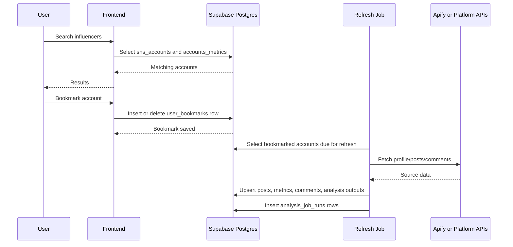

# Influencer Search and Bookmark Usage Scenario

This file replaces an older form-management scenario from a previous app concept. The current product does not implement forms. The comparable workflow in the current app is influencer discovery, bookmarking, and refresh.

## Actors

- User: authenticated marketer or campaign operator.
- Frontend: React app in `frontend-influencer/`.
- Supabase: Auth, Postgres, and Edge Functions.
- Refresh job: `apify-scrapers/bookmarked_weekly_refresh.py`.

## Scenario 1: Search Influencers

1. The user opens the influencer search page.
2. The frontend loads keyword options from `sns_accounts.keywords`.
3. The user selects platforms and optional filters for username, keywords, likes, posts, followers, and campaign.
4. The frontend navigates to the search results page with filter state.
5. The results page queries `sns_accounts` with embedded `accounts_metrics`.
6. The frontend filters metric ranges client-side using the latest metric row.
7. The user can open an influencer detail page.

Current implementation paths:

- `frontend-influencer/src/pages/search/search_page.tsx`
- `frontend-influencer/src/pages/search/search_results.tsx`
- `frontend-influencer/src/pages/search/influencer_detail.tsx`

## Scenario 2: Bookmark Influencers

1. The user clicks the bookmark action on a search result.
2. The frontend upserts or deletes a row in `user_bookmarks`.
3. The bookmark page loads `user_bookmarks` for the current user and joins the matching `sns_accounts` rows.
4. Folder and tag item rows point to `user_bookmarks.id` through `bookmark_id`.
5. The user can remove bookmarks from the bookmark page.

Current implementation paths:

- `frontend-influencer/src/pages/search/search_results.tsx`
- `frontend-influencer/src/pages/bookmark/bookmarks.tsx`

## Scenario 3: Review Influencer Detail Analysis

1. The user opens an influencer detail page.
2. The frontend loads the account from `sns_accounts`.
3. The frontend embeds latest `accounts_metrics`.
4. The frontend loads `influencer_average_comment_analysis` for `window = all_posts`.
5. The page displays profile, metrics, and comment analysis summaries.

Current implementation path:

- `frontend-influencer/src/pages/search/influencer_detail.tsx`

## Scenario 4: Refresh Bookmarked Influencers

1. A scheduler, developer, or operator runs `bookmarked_weekly_refresh.py`.
2. The script reads bookmarked accounts from `bookmarked_accounts_for_refresh`.
3. The script checks `analysis_job_runs` freshness.
4. Due accounts have posts/comments refreshed and analysis steps run.
5. Step-level statuses are written to `analysis_job_runs`.
6. Frontend pages read the updated account, metric, post, and analysis tables.

Smoke command:

```bash
BOOKMARK_PLATFORMS=instagram \
BOOKMARK_ANALYSIS_REFRESH_HOURS=0 \
BOOKMARK_MAX_ACCOUNTS_PER_RUN=1 \
BOOKMARK_ANALYZE_POSTS_PER_ACCOUNT=3 \
BOOKMARK_SLEEP_SECONDS=0 \
.venv/bin/python apify-scrapers/bookmarked_weekly_refresh.py
```

## Data Flow


```mermaid
sequenceDiagram
  participant User
  participant UI as Frontend
  participant DB as Supabase Postgres
  participant Job as Refresh Job
  participant APIs as Apify or Platform APIs

  User->>UI: Search influencers
  UI->>DB: Select sns_accounts and accounts_metrics
  DB-->>UI: Matching accounts
  UI-->>User: Results

  User->>UI: Bookmark account
  UI->>DB: Insert or delete user_bookmarks row
  DB-->>UI: Bookmark saved

  Job->>DB: Select bookmarked accounts due for refresh
  Job->>APIs: Fetch profile/posts/comments
  APIs-->>Job: Source data
  Job->>DB: Upsert posts, metrics, comments, analysis outputs
  Job->>DB: Insert analysis_job_runs rows
```

## Tables

- `sns_accounts`
- `accounts_metrics`
- `posts`
- `post_metrics_snapshots`
- `post_comments_raw`
- `post_comment_analysis`
- `post_commenter_quality_analysis`
- `post_sponsorship_analysis`
- `influencer_average_comment_analysis`
- `influencer_commenter_quality_summary`
- `influencer_growth_anomaly_summary`
- `influencer_performance_summary`
- `analysis_job_runs`
