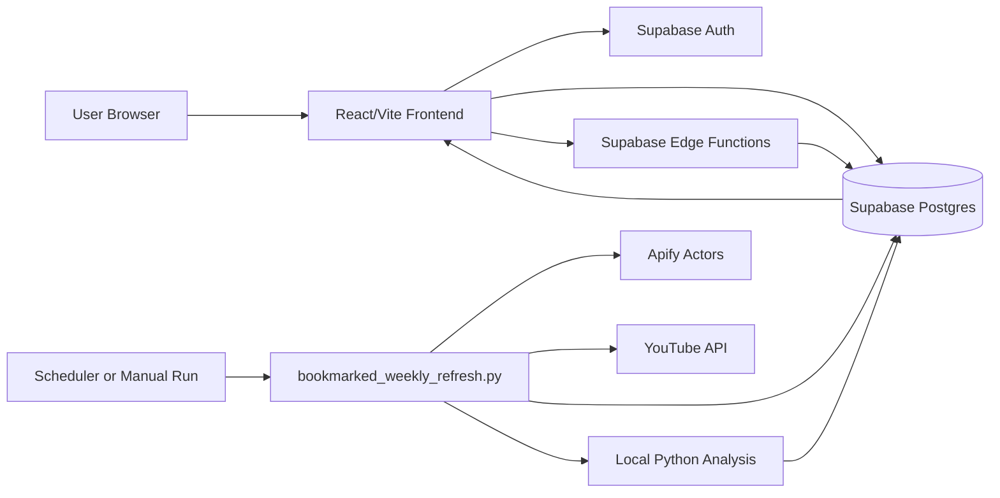

# System Architecture

## High-Level Shape

The app has three main parts:

- `frontend-influencer/`: React/Vite single-page app for search, bookmarks, campaign management, auth, and influencer detail views.
- `supabase/`: Supabase Edge Functions and migrations for auth-adjacent backend actions and database changes.
- `apify-scrapers/`: Python ingestion, scraping, and analysis jobs that populate and refresh influencer data.

## Runtime Flow



## Frontend

The frontend reads and writes Supabase data directly for the current product screens:

- `sns_accounts` and `accounts_metrics` for home, search, results, detail, and bookmarks.
- `influencer_average_comment_analysis` for influencer detail analysis cards.
- `campaigns` for campaign CRUD and add-to-campaign actions.
- `users` for email verification state.

Authentication is centralized in `src/contexts/AuthContext.tsx`.

## Edge Functions

Supabase Edge Functions provide server-side operations where service-role access or token validation is needed:

- `profile-upsert`: writes authenticated user profile metadata to `users`.
- `campaign-create`: creates campaign records for the authenticated user.
- `campaign-list`: lists campaign records for the authenticated user.
- `auth-email-verified`: mirrors email verification to the profile table.
- `sync-instagram-account`: syncs an Instagram account profile and account metrics.
- `sync-instagram-posts`: syncs Instagram posts, post metric snapshots, hashtags, and account metric rollups.

## Scraper and Analysis Jobs

Platform-specific scripts ingest profiles, posts, comments, and metrics. The recommended production-style entrypoint is:

```bash
.venv/bin/python apify-scrapers/bookmarked_weekly_refresh.py
```

That script coordinates:

- bookmarked account selection from `sns_accounts.bookmarks`
- platform-specific post refresh
- post comment analysis
- post commenter quality analysis
- post sponsorship analysis
- account-level comment average aggregation
- commenter quality summary aggregation
- growth anomaly analysis
- performance summary aggregation
- step-level run recording in `analysis_job_runs`

Use platform-specific scripts for debugging one platform, not as the normal scheduled workflow.

## Database

Supabase Postgres is the source of truth for:

- account and post data
- campaign data
- user profile data
- analysis outputs
- scraper job status

See `docs/database-schema.md` for the table map and relationship overview.

## Deployment and Scheduling

- Frontend build output is deployed with Firebase Hosting.
- Supabase Edge Functions are deployed with the Supabase CLI.
- Database changes are pushed with `supabase db push`.
- The bookmarked refresh should be run daily from cron, launchd, GitHub Actions, or another scheduler. The script decides which bookmarked accounts are due based on `analysis_job_runs` and `BOOKMARK_ANALYSIS_REFRESH_HOURS`.

## Required Local Verification

Frontend:

```bash
cd frontend-influencer
npm run lint
npm run build
```

Python syntax:

```bash
python3 -m compileall -q apify-scrapers
```

Backend smoke refresh:

```bash
BOOKMARK_PLATFORMS=instagram \
BOOKMARK_ANALYSIS_REFRESH_HOURS=0 \
BOOKMARK_MAX_ACCOUNTS_PER_RUN=1 \
BOOKMARK_ANALYZE_POSTS_PER_ACCOUNT=3 \
BOOKMARK_SLEEP_SECONDS=0 \
.venv/bin/python apify-scrapers/bookmarked_weekly_refresh.py
```
